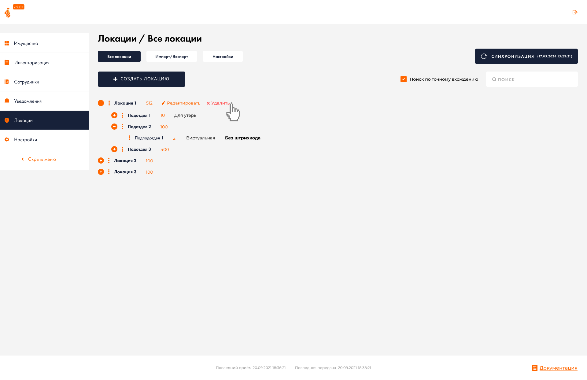
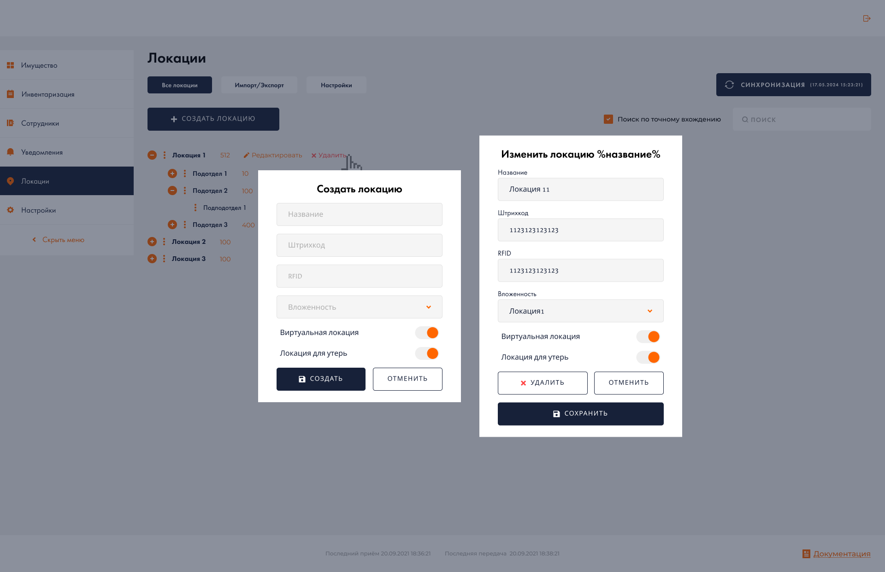
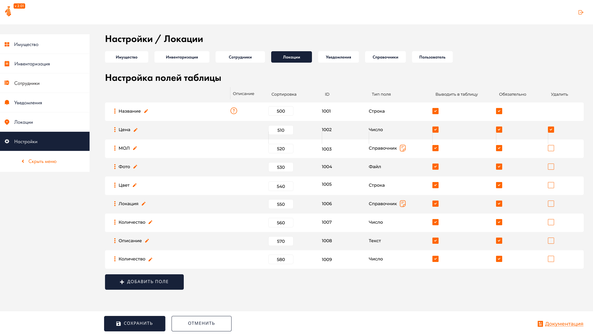

# Задание получено от компании с сайта hh.ru
### Суть задание: Необходимо сверстать сайт по макету Figma, ниже представлены скриншоты. Готовый код находиться в папке _project_. Также можете посмотреть готовые сайты [Локация](https://webflomd.github.io/TZ_2/project/index.html) и [Настройки](https://webflomd.github.io/TZ_2/project/table.html)

